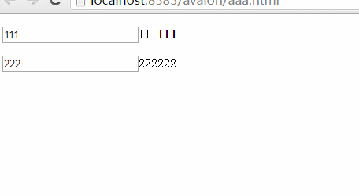
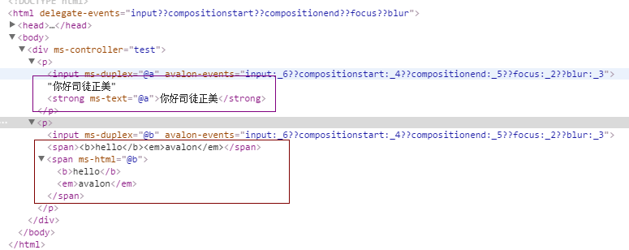

## avalon2 learning document(03)：fill-data
### In avalon1,there are four means of data filling
        {{expr}}, {{expr|html}}, ms-text, ms-html
    
In fact,the first and third kinds of the same as the output plain text. The second and fourth,if the user's data is some HTML tags, it will be converted into element nodes and inserted into the current location.

        
        
        
    </head>
    <body>
        

            
<input ms-duplex="@a" />{{@a}}<strong ms-text="@a"></strong>

            
<input ms-duplex="@b" />{{@b}}

        

    </body>
    
    

We press F12 to see the situation of the console

Visible ms-html power, but he is very consumption performance, like react, do not recommend the use of it：

    var content='<strong>content</strong>';    
    React.render(
        `

`,
        document.body
    );
    
Because the HTML user is a lot of freedom, you can be optionally added Onclick,src="data:text/html;base64,SGVsbG8sIFdvcmxkIQ%3D%3D",script tags.
Thus doing much sabotage activities,So avalon2 does not recommend people to use it a lot.  

If you have to use, it is best to use the sanitize filter for XSS processing:
    
    

    
Also worth noting is that We apply the interpolation expression {{}} to the first page of the site，there Will be a lot of garbled phenomenon when the network is slow （For example：{{@b}}），We have two ways to fix them.

###### The first method, add ms-controller class name, the current area to hide the first, avalon scan here will automatically hide them（Note that this style must be written above the head to facilitate its first time to be applied）

    .ms-controller{
        display:none;
    }

###### The second method, the use of ms-text instead of {{}}, the most worry-free the most effective than the first effect.

Data padding is the most basic function of traditional static templates.
So when you mix avalon and other back-end templates, there will be conflicts, because we all use the {{}} delimiter. At this point we can use the following configuration delimiter, note that this script is also placed in front of the head, or ensure that you run it before the scan.

    avalon.config({
        interpolate:[""]
    })

At this point, we can get the “" through avalon.config.openTag and avalon.config.closeTag.

Note:<, > can not appear inside delimiters，Because there is compatibility issues，The two delimiters can not be the same, the best their length > 1.

    
